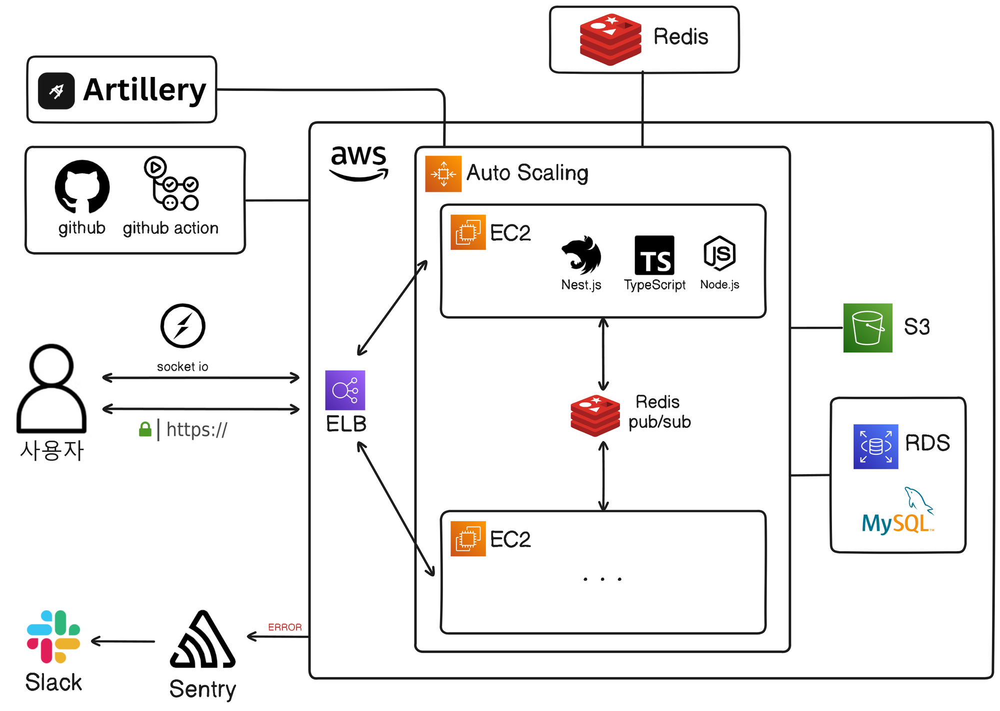
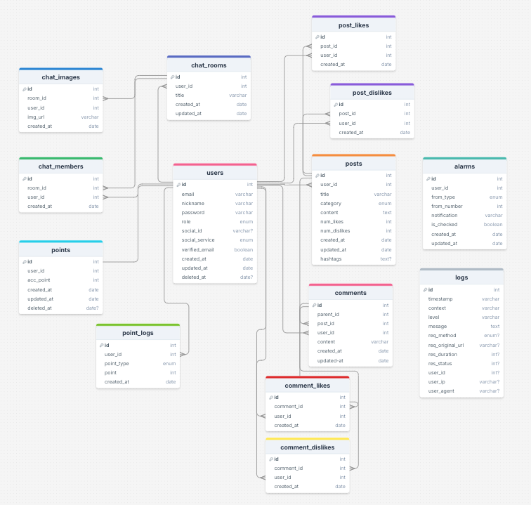

# 🖥️ Team 싱싱복숭아 / 5ZIRAP 프로젝트

  

## 📝 목차

1. 프로젝트 소개
2. 팀원 구성
3. 개발 기간
4. 개발 환경
5. 시스템 아키텍처
6. 와이어 프레임
7. ERD
8. API
9. 파일 구조
10. FAQ 및 연락처
11. 성과 및 회고

---

## 📝 1. 프로젝트 소개

프로젝트 이름 : 5ZIRAP 프로젝트

내용 : 타인 패션에 실시간 채팅 및 게시글 작성과 댓글을 통해 오지랖 부리는 패션 커뮤니티 서비스

구분 : 팀 프로젝트

📹 시연 영상

- 중간 발표 시연 영상 : [중간 발표 시연 영상 바로가기](https://youtu.be/zSOTA8icjtc)
- 최종 발표 시연 영상 : [최종 발표 시연 영상 바로가기](https://www.youtube.com/watch?v=oWCF9iayqWg)

🏠 배포 : https://5zirap.shop

### [How To Install?](docs/Installation.md)

👉 [서비스 주요 기능 보러가기](https://teamsparta.notion.site/77371eacf273486eb64a63264d11583d)

## 👨‍👩‍👧‍👦 2. 팀원 구성

- 리더 : 이강산 [@KangSanLee24](https://github.com/KangSanLee24)
- 부리더 : 석한솔 [@CDR4733](https://github.com/CDR4733)
- 팀원 : 이주언 [@ttt20222](https://github.com/ttt20222)
- 팀원 : 엄혜인 [@Eomhyein](https://github.com/Eomhyein)
- 팀원 : 박근균 [@pcpp0606](https://github.com/pcpp0606)

## 🗓️ 3. 개발 기간

**2024.07.19 ~ 2024.08.27**
- 2024.08.09 중간 발표
- 2024.08.27 최종 발표

## ⚙ 4. 개발 환경

<h3 tabindex="-1" dir="auto">
✔</g-emoji> Front-end</h3>

<h3 tabindex="-1" dir="auto">
✔</g-emoji> Back-end</h3>

<h3 tabindex="-1" dir="auto">
✔</g-emoji> Database</h3>

<h3 tabindex="-1" dir="auto">
✔</g-emoji> 협업툴</h3>

## 🛠️ 5. 시스템 아키텍처

## 🎇 6. 와이어 프레임

## 📒 7. ERD

## 📝 8. API

👉 [API 문서 바로가기](docs/api.md)

## 📝 9. 파일 구조
👉 [파일 구조 바로가기](docs/file-tree.md)

## 📞 10. FAQ 및 연락처

팀장 이강산 gangsan1414@gmail.com

## 🔎 11. 성과 및 회고

👉 [성과 및 회고 문서 바로가기](docs/trouble-shouting.md)
