# API

## 목차

1. [AUTH API](#01-auth-api)
2. [USER API](#02-user-api)
3. [POST API](#03-post-api)
4. [COMMENT API](#04-comment-api)
5. [RECOMMENT API](#05-recomment-api)
6. [ALARM API](#06-alarm-api)
7. [CHAT API](#07-chat-api)
8. [HASHTAG API](#08-hashtag-api)
9. [POINT API](#09-point-api)
10. [SHOPPING API](#10-shopping-api)
11. [LOG API](#11-log-api)

---

## 01. AUTH API

: 사용자 인증 관련 API 입니다.

### 1. 회원가입 API

https://github.com/KangSanLee24/hunsu-project/blob/dev/src/auth/auth.controller.ts#L47

  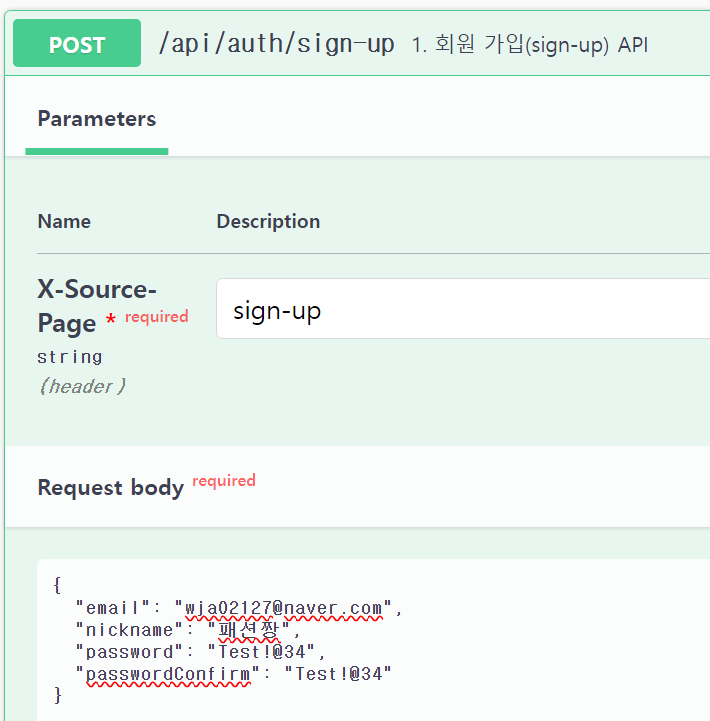
  

### 2. 로그인 API

https://github.com/KangSanLee24/hunsu-project/blob/dev/src/auth/auth.controller.ts#L59

  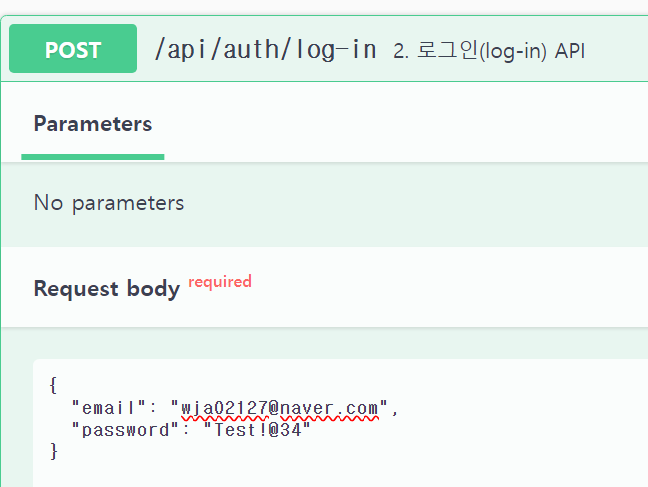
  

### 3. 로그아웃API

https://github.com/KangSanLee24/hunsu-project/blob/dev/src/auth/auth.controller.ts#L73

  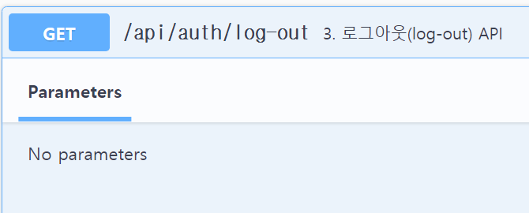
  

### 4. 토큰 재발급 API

https://github.com/KangSanLee24/hunsu-project/blob/dev/src/auth/auth.controller.ts#L87

  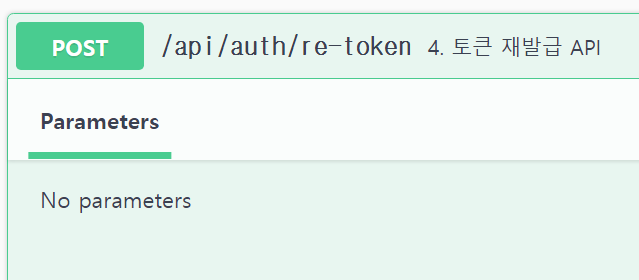
  

### 5. 이메일 인증 API

https://github.com/KangSanLee24/hunsu-project/blob/dev/src/auth/auth.controller.ts#L99

  
  

### 5-1A. NAVER 로그인 API

https://github.com/KangSanLee24/hunsu-project/blob/dev/src/auth/auth.controller.ts#L113

### 5-1B. NAVER 로그인 콜백 API

https://github.com/KangSanLee24/hunsu-project/blob/dev/src/auth/auth.controller.ts#L120

### 5-1C. NAVER 로그인 리콜 API

https://github.com/KangSanLee24/hunsu-project/blob/dev/src/auth/auth.controller.ts#L129

### 5-2A. GOOGLE 로그인 API

https://github.com/KangSanLee24/hunsu-project/blob/dev/src/auth/auth.controller.ts#L144

### 5-2B. GOOGLE 로그인 콜백 API

https://github.com/KangSanLee24/hunsu-project/blob/dev/src/auth/auth.controller.ts#L148

### 6. 비밀번호 변경 요청 API

https://github.com/KangSanLee24/hunsu-project/blob/dev/src/auth/auth.controller.ts#L167

  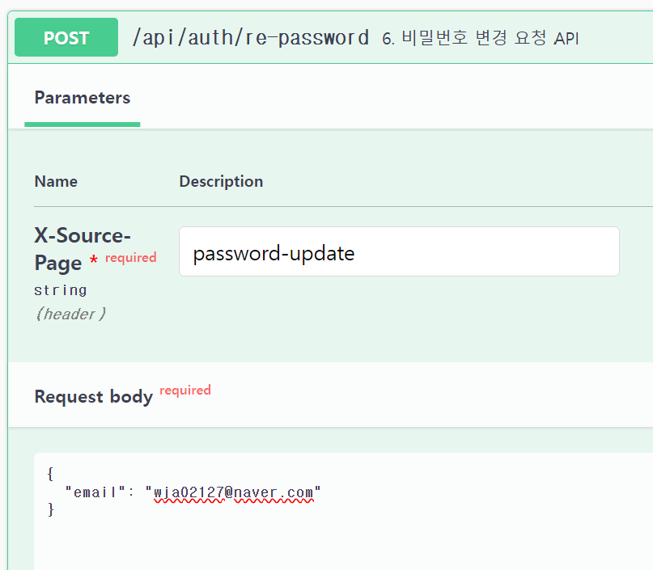
  

### 7. 비밀번호 변경 인증 API

https://github.com/KangSanLee24/hunsu-project/blob/dev/src/auth/auth.controller.ts#L178

  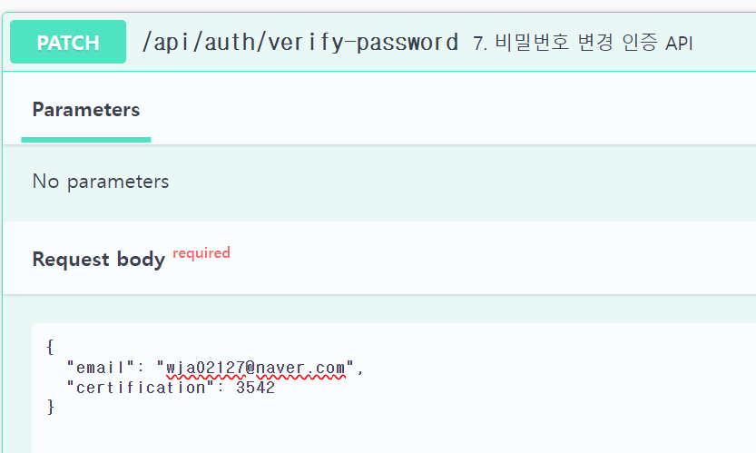
  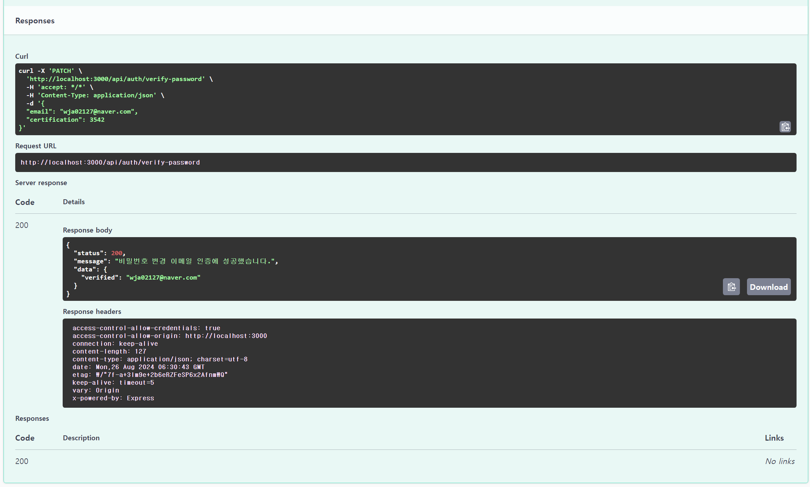

### 8. 비밀번호 변경 API

https://github.com/KangSanLee24/hunsu-project/blob/dev/src/auth/auth.controller.ts#L190

  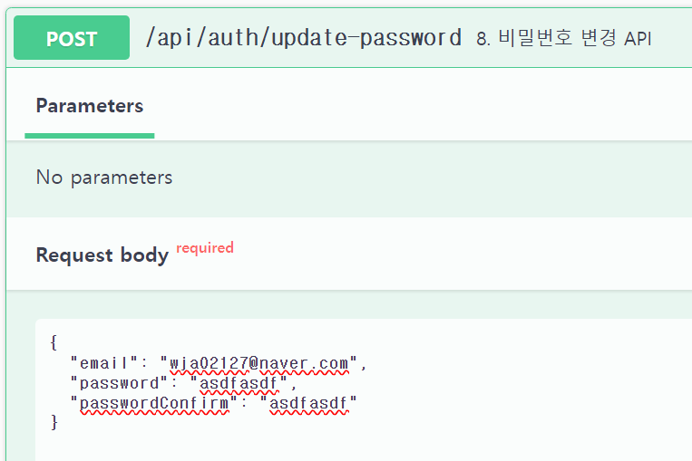
  

### 9. 아이디 찾기 API

https://github.com/KangSanLee24/hunsu-project/blob/dev/src/auth/auth.controller.ts#L202

  
  

## 02. USER API

: 사용자 정보 관련 API입니다.

### 1. 회원 정보 조회 API

https://github.com/KangSanLee24/hunsu-project/blob/dev/src/user/user.controller.ts#L95

  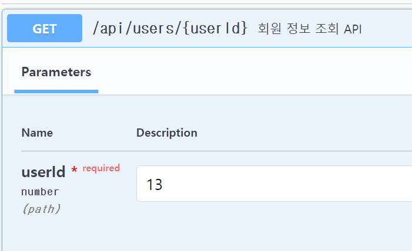
  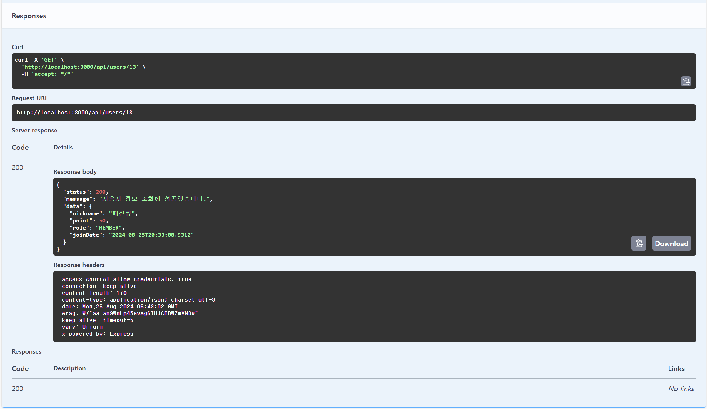

### 2. 내 정보 조회 API

https://github.com/KangSanLee24/hunsu-project/blob/dev/src/user/user.controller.ts#L34

  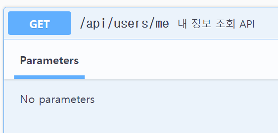
  

### 3. 내 정보 수정API

https://github.com/KangSanLee24/hunsu-project/blob/dev/src/user/user.controller.ts#L80

  
  

### 4. 회원탈퇴 API

https://github.com/KangSanLee24/hunsu-project/blob/dev/src/user/user.controller.ts#L109

  
  

### 5. 사용자가 작성한 댓글 조회 API

https://github.com/KangSanLee24/hunsu-project/blob/dev/src/user/user.controller.ts#L64

  
  

### 6. 사용자가 작성한 게시글 조회 API

https://github.com/KangSanLee24/hunsu-project/blob/dev/src/user/user.controller.ts#L48

  
  

## 03. POST API

: 게시글 관련 API입니다.

### 1. 게시글 생성 API

https://github.com/KangSanLee24/hunsu-project/blob/dev/src/post/post.controller.ts#L45

  
  

### 2. 게시글 목록 조회 API

https://github.com/KangSanLee24/hunsu-project/blob/dev/src/post/post.controller.ts#L84

  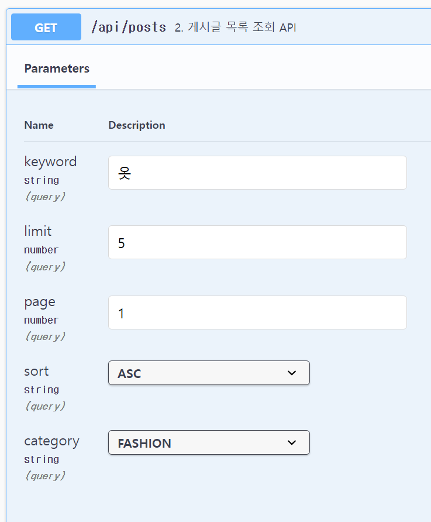
  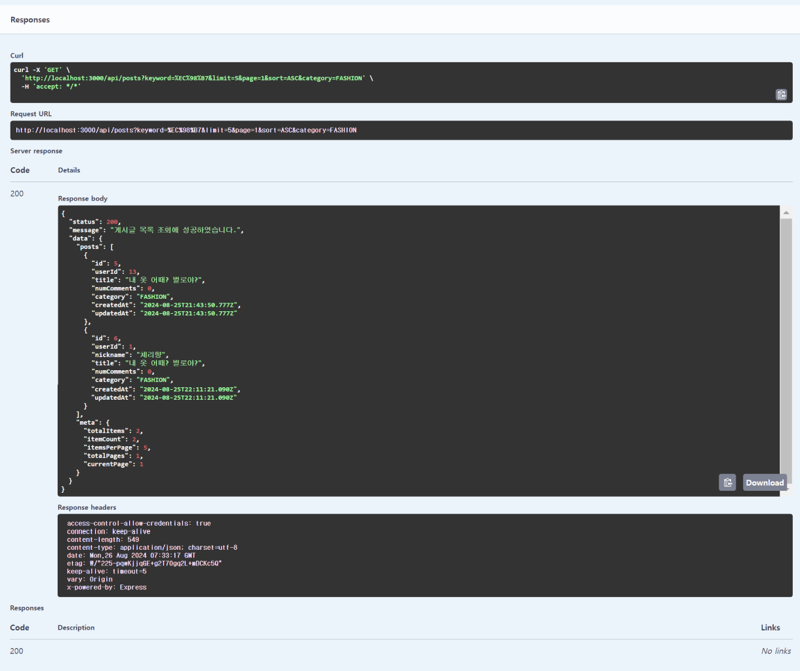

### 3. 게시글 상세 조회 API

https://github.com/KangSanLee24/hunsu-project/blob/dev/src/post/post.controller.ts#L148

  
  

### 4. 게시글 수정 API

https://github.com/KangSanLee24/hunsu-project/blob/dev/src/post/post.controller.ts#L163

  
  

### 5. 게시글 삭제 API

https://github.com/KangSanLee24/hunsu-project/blob/dev/src/post/post.controller.ts#L182

  
  

### 6. 게시글 강제 삭제 API

https://github.com/KangSanLee24/hunsu-project/blob/dev/src/post/post.controller.ts#L197

### 7. 게시글 이미지 업로드 API

https://github.com/KangSanLee24/hunsu-project/blob/dev/src/post/post.controller.ts#L136

  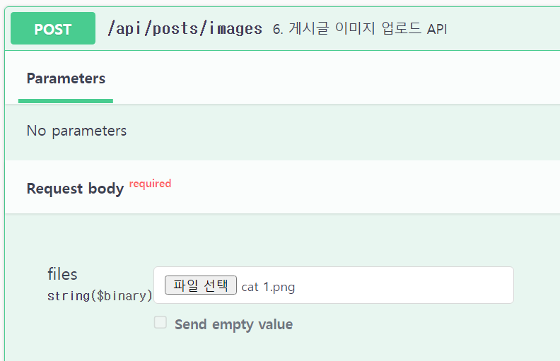

### 8. 화제글 목록 조회 API

https://github.com/KangSanLee24/hunsu-project/blob/dev/src/post/post.controller.ts#L109

### 9. 게시글 좋아요 조회 API

https://github.com/KangSanLee24/hunsu-project/blob/dev/src/post/post.controller.ts#L210

  
  

### 10. 나의 게시글 좋아요 여부 조회 API

https://github.com/KangSanLee24/hunsu-project/blob/dev/src/post/post.controller.ts#L225

  
  

### 11. 게시글 좋아요 클릭 API

https://github.com/KangSanLee24/hunsu-project/blob/dev/src/post/post.controller.ts#L243

  
  

### 12. 게시글 싫어요 조회 API

https://github.com/KangSanLee24/hunsu-project/blob/dev/src/post/post.controller.ts#L259

  
  

### 13. 나의 게시글 싫어요 여부 조회 API

https://github.com/KangSanLee24/hunsu-project/blob/dev/src/post/post.controller.ts#L274

  
  

### 14. 게시글 싫어요 클릭 API

https://github.com/KangSanLee24/hunsu-project/blob/dev/src/post/post.controller.ts#L292

  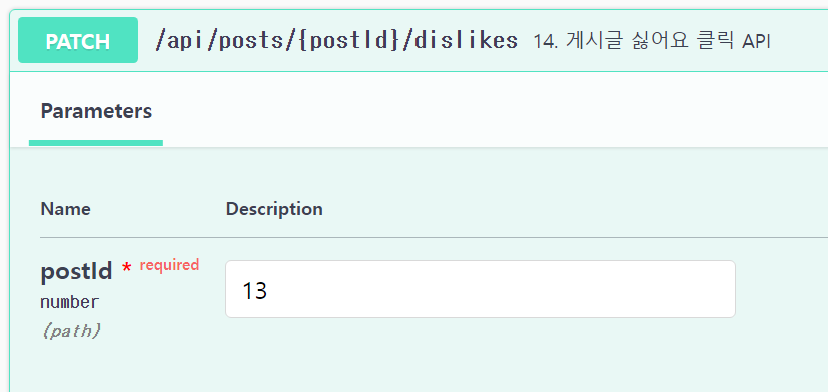
  

## 04. COMMENT API

: 댓글 관련 API입니다.

### 1. 댓글 생성 API

https://github.com/KangSanLee24/hunsu-project/blob/dev/src/comment/comment.controller.ts#L37

  
  

### 2. 댓글 목록 조회 API

https://github.com/KangSanLee24/hunsu-project/blob/dev/src/comment/comment.controller.ts#L60

  
  

### 3. 댓글 수정 API

https://github.com/KangSanLee24/hunsu-project/blob/dev/src/comment/comment.controller.ts#L75

  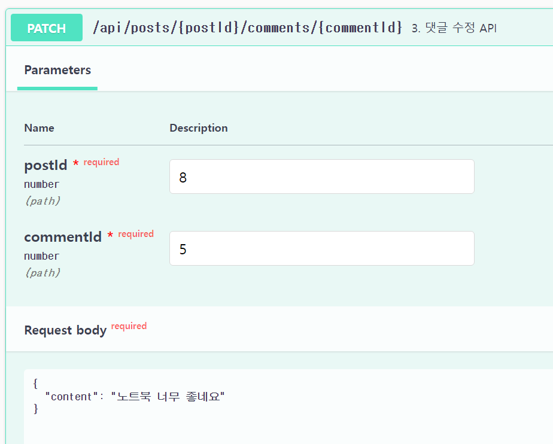
  

### 4. 댓글 삭제 API

https://github.com/KangSanLee24/hunsu-project/blob/dev/src/comment/comment.controller.ts#L102

  
  

### 5. 댓글 강제 삭제 API

https://github.com/KangSanLee24/hunsu-project/blob/dev/src/comment/comment.controller.ts#L120

### 6. 댓글 좋아요 조회 API

https://github.com/KangSanLee24/hunsu-project/blob/dev/src/comment/comment.controller.ts#L136

  
  

### 7. 나의 댓글 좋아요 여부 조회 API

https://github.com/KangSanLee24/hunsu-project/blob/dev/src/comment/comment.controller.ts#L150

  
  

### 8. 댓글 좋아요 클릭 API

https://github.com/KangSanLee24/hunsu-project/blob/dev/src/comment/comment.controller.ts#L168

  
  

### 9. 댓글 싫어요 조회 API

https://github.com/KangSanLee24/hunsu-project/blob/dev/src/comment/comment.controller.ts#L184

  
  

### 10. 나의 댓글 싫어요 여부 조회 API

https://github.com/KangSanLee24/hunsu-project/blob/dev/src/comment/comment.controller.ts#L200

  
  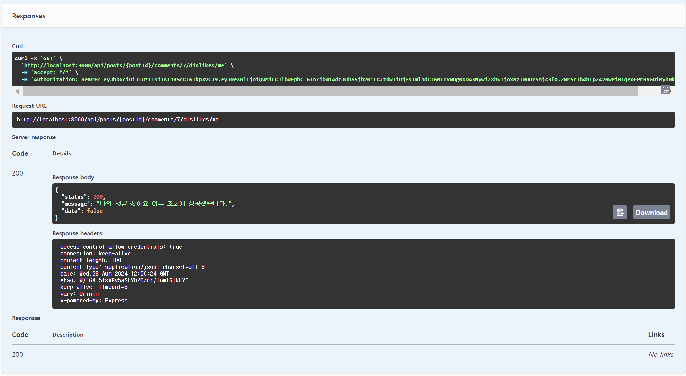

### 11. 댓글 싫어요 클릭 API

https://github.com/KangSanLee24/hunsu-project/blob/dev/src/comment/comment.controller.ts#L221

  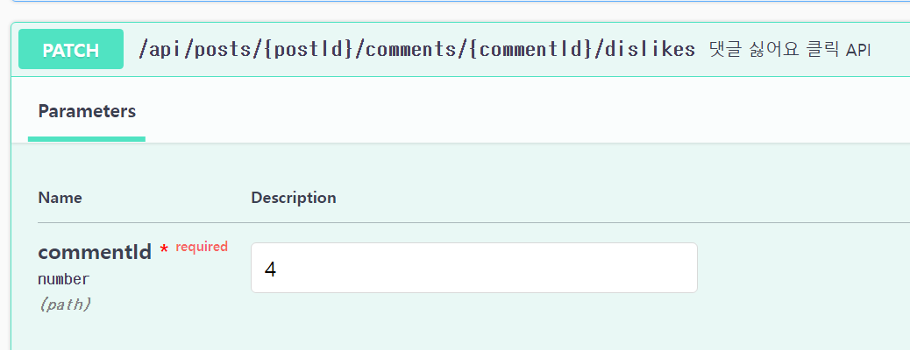
  

## 05. RECOMMENT API

: 대댓글 관련 API입니다.

### 1. 대댓글 생성 API

https://github.com/KangSanLee24/hunsu-project/blob/dev/src/recomment/recomment.controller.ts#L36

  
  

### 2. 대댓글 목록 조회 API

https://github.com/KangSanLee24/hunsu-project/blob/dev/src/recomment/recomment.controller.ts#L56

  
  

### 3. 대댓글 수정 API

https://github.com/KangSanLee24/hunsu-project/blob/dev/src/recomment/recomment.controller.ts#L70

  
  

### 4. 대댓글 삭제 API

https://github.com/KangSanLee24/hunsu-project/blob/dev/src/recomment/recomment.controller.ts#L101

  
  

## 06. ALARM API

: 알람 관련 API입니다

### 1. 알람 생성 API

https://github.com/KangSanLee24/hunsu-project/blob/dev/src/alarm/alarm.controller.ts#L38

### 2. 알람 목록 조회 API

https://github.com/KangSanLee24/hunsu-project/blob/dev/src/alarm/alarm.controller.ts#L70

### 3. 알람 클릭 API

https://github.com/KangSanLee24/hunsu-project/blob/dev/src/alarm/alarm.controller.ts#L88

### 4-1. 알람 수정 - [읽음] 처리 반전 (개별선택) API

https://github.com/KangSanLee24/hunsu-project/blob/dev/src/alarm/alarm.controller.ts#L102

### 4-2. 알람 수정 - [읽음] 처리 (남은 알람 전부) API

https://github.com/KangSanLee24/hunsu-project/blob/dev/src/alarm/alarm.controller.ts#L116

### 5-1. 알람 수동 삭제 -(개별선택) API

https://github.com/KangSanLee24/hunsu-project/blob/dev/src/alarm/alarm.controller.ts#L131

### 5-2. 알람 수동 삭제 - [읽음] 처리된 것들 모두 API

https://github.com/KangSanLee24/hunsu-project/blob/dev/src/alarm/alarm.controller.ts#L145

### 6. 신규 생성 이벤트 알람 (SSE) API

https://github.com/KangSanLee24/hunsu-project/blob/dev/src/alarm/alarm.controller.ts#L163

## 07. CHAT API

: 채팅방 관련 API입니다.

### 1. 채팅방 생성 API

https://github.com/KangSanLee24/hunsu-project/blob/dev/src/chat/chat.controller.ts#L34

### 2. 채팅방 목록 조회 (전체 목록 조회) API

https://github.com/KangSanLee24/hunsu-project/blob/dev/src/chat/chat.controller.ts#L46

### 3. 채팅방 삭제 API

https://github.com/KangSanLee24/hunsu-project/blob/dev/src/chat/chat.controller.ts#L153

### 4. 채팅방 마지막 시간 계산 API

https://github.com/KangSanLee24/hunsu-project/blob/dev/src/chat/chat.controller.ts#L64

### 5. 채팅방 이미지 전송 API

https://github.com/KangSanLee24/hunsu-project/blob/dev/src/chat/chat.controller.ts#L121

### 6. 채팅방 입장 API

https://github.com/KangSanLee24/hunsu-project/blob/dev/src/chat/chat.controller.ts#L110

### 7. 채팅방 멤버 목록 조회 API

https://github.com/KangSanLee24/hunsu-project/blob/dev/src/chat/chat.controller.ts#L74

### 8. 채팅방 인원 계산 API

https://github.com/KangSanLee24/hunsu-project/blob/dev/src/chat/chat.controller.ts#L55

### 9. 채팅방 나가기 API

https://github.com/KangSanLee24/hunsu-project/blob/dev/src/chat/chat.controller.ts#L142

### 10.실시간 핫라이브챗 조회 API

https://github.com/KangSanLee24/hunsu-project/blob/dev/src/chat/chat.controller.ts#L83

### 11. 채팅방 검색 API

https://github.com/KangSanLee24/hunsu-project/blob/dev/src/chat/chat.controller.ts#L97

## 08. HASHTAG API

: 해시태그 API 입니다.

### 1. 해시태그 랭킹 조회 API

https://github.com/KangSanLee24/hunsu-project/blob/dev/src/hashtag/hashtag.controller.ts#L14

## 09. POINT API

: 포인트 관련 API입니다.

### 1. 포인트 조회 API

https://github.com/KangSanLee24/hunsu-project/blob/dev/src/point/point.controller.ts#L45

### 2. 누적 포인트 랭킹 조회 API

https://github.com/KangSanLee24/hunsu-project/blob/dev/src/point/point.controller.ts#L60

### 3. 주간 포인트 랭킹 조회 API

https://github.com/KangSanLee24/hunsu-project/blob/dev/src/point/point.controller.ts#L86

### 4. 종합 포인트 랭킹 조회 - 레디스 API

https://github.com/KangSanLee24/hunsu-project/blob/dev/src/point/point.controller.ts#L96

### 5. 주간 포인트 랭킹 조회 -레디스 API

https://github.com/KangSanLee24/hunsu-project/blob/dev/src/point/point.controller.ts#L74

### 6. 출석 체크 API

https://github.com/KangSanLee24/hunsu-project/blob/dev/src/point/point.controller.ts#L28

## 10. SHOPPING API

: 네이버 쇼핑 관련 API입니다.

### 1. 네이버 쇼핑 상품 검색 API

https://github.com/KangSanLee24/hunsu-project/blob/dev/src/shopping/shopping.controller.ts#L6

## 11. LOG API

: 로그 관련 API입니다.

### 1. 로그 목록 조회 API

https://github.com/KangSanLee24/hunsu-project/blob/dev/src/log/log.controller.ts#L70

### 2. 로그 상세 조회 API

https://github.com/KangSanLee24/hunsu-project/blob/dev/src/log/log.controller.ts#L130

### 3. 로그 삭제 API

https://github.com/KangSanLee24/hunsu-project/blob/dev/src/log/log.controller.ts#L143

### 4. 로그 DB 전송 API

https://github.com/KangSanLee24/hunsu-project/blob/dev/src/log/log.controller.ts#L104

### 5. 로그 DB 전송 - 파일명 직접 입력 API

https://github.com/KangSanLee24/hunsu-project/blob/dev/src/log/log.controller.ts#L117
